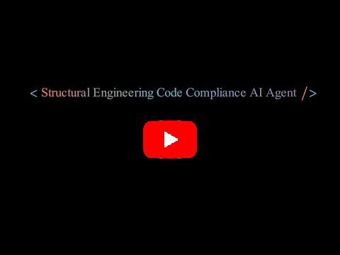
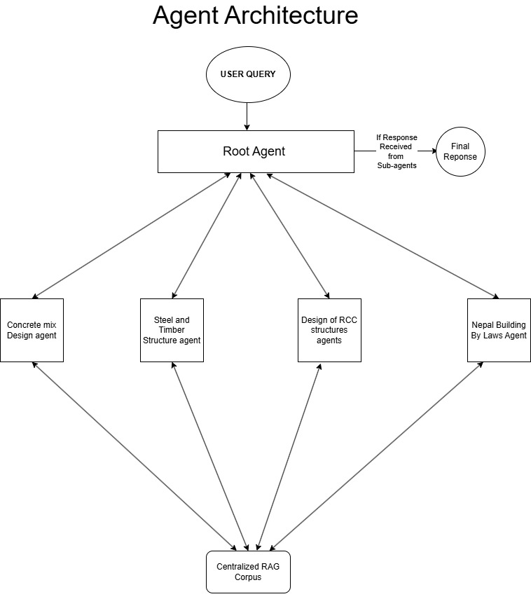
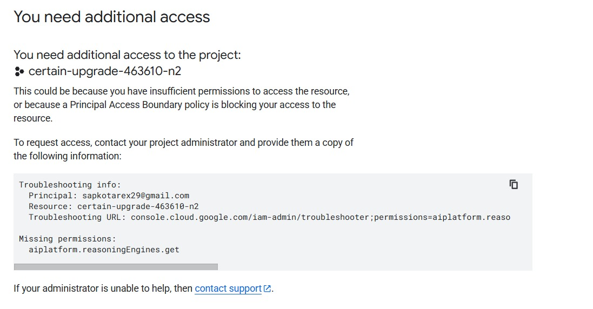

## 🧭 Introduction

This repository contains code for creating, deploying, and interacting with a Retrieval-Augmented-Generation (RAG) based AI agent created for the 2025 Google ADK Hackathon. The agent specializes in providing consultation for region-specific structural engineering guidelines for India and Nepal. To do this, it utilizes a RAG Corpus created using relevant Indian and Nepalese engineering guideline documents alongisde with four specialized sub-agents that query this RAG Corpus and formulate a response. The specialized sub-agents are as follows:
- Building ByLaws Agent
- RCC Structure Agent
- Concrete Mix Design Agent
- Steel Structure Agent

## ⭐ Demo
[](https://youtu.be/LrrOuAI7z1Y)

## 🚀 Quickstart
To get started, set up a Google Cloud Project with a custom RAG Corpus, and enter the environment variables in .env.example. Then, install the required dependencies using pip:
```
pip install -r requirements.txt
```
To test the agent locally. Run:
```
adk web
```
Once you've verified that the agent functions as expected, deploy the agent to Vertex AI by running
```
python3 deploy.py
```
After successful deployment, fill in the rest of the required environment variables and interact with your deployed agent by running
```
python3 run.py
```

## 🏗️ Architecture Diagram


## 🧑‍⚖️ Hackathon Judging
For a limited time, a fully deployed AI agent is available on Vertex AI for judging purposes. The agent link on the submission form should lead to a webpage indicating the following error: 

This is by design and is intended to limit public access. To request access to the deployed model, forward the error message to rajwolchapagain@gmail.com. 

## Devpost
Link: https://devpost.com/software/structural-engineering-code-compliance-agent 
